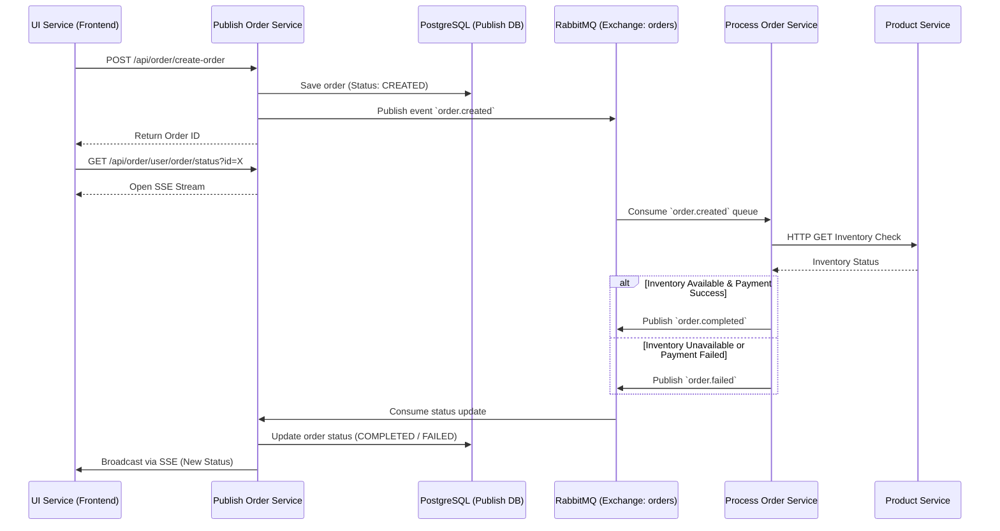

# Core Architecture & Event Flow

Velure relies on an event-driven microservices architecture to handle its core business processes, particularly the order lifecycle. This approach ensures high availability, loose coupling, and scalability across the platform without relying on a single centralized database.

## Order Lifecycle Event Flow

The most critical flow in Velure is the order creation and processing pipeline. It utilizes HTTP for synchronous initial requests and Server-Sent Events (SSE), while relying on RabbitMQ for asynchronous processing between backend services.

Below is the sequence diagram illustrating the complete order lifecycle:

## Distributed State Management

In this architecture, Velure avoids a monolithic centralized database. Instead, state is managed across services using an event-driven approach.

The order transitions through the following states:
1. **CREATED**: The initial state when the `publish-order-service` receives the request and saves it to its local PostgreSQL database.
2. **PROCESSING**: The state when the `process-order-service` picks up the event from RabbitMQ and begins validating inventory via the `product-service` and handling simulated payment logic.
3. **COMPLETED / FAILED**: The terminal states. Once the `process-order-service` finishes its operations, it publishes a final event back to RabbitMQ. The `publish-order-service` consumes this, updates the local database, and pushes the final state to the frontend via SSE.

This decoupled design ensures that if the processing or product services are temporarily unavailable, orders are not lost—they remain safely queued in RabbitMQ until they can be processed.

## FAQ: Por que RabbitMQ e não Amazon SQS?

Uma pergunta comum ao ver essa arquitetura provisionada na AWS é: *"Se o projeto usa Terraform e foca na nuvem, por que subir um broker RabbitMQ (via Amazon MQ) em vez de usar um serviço serverless nativo como o Amazon SQS?"*

A resposta principal é **objetivo de aprendizado**.

Sendo o Velure um projeto focado em solidificar conhecimentos de DevSecOps e Arquitetura Cloud-Native, o RabbitMQ apresentou um escopo técnico mais desafiador e enriquecedor:

- **Complexidade e Padrões de Roteamento:** O RabbitMQ utiliza um protocolo rico (AMQP) e permite a implementação de padrões complexos como *Exchanges* (Topic, Direct, Fanout) e *Bindings*. O SQS é primariamente uma fila simples (apesar de poder ser combinado com o SNS, o gerenciamento de tópicos e roteamento do RabbitMQ exige uma configuração arquitetural mais detalhada).
- **Gerenciamento de Infraestrutura:** Subir e gerenciar credenciais, virtual hosts (vhosts) e painéis de administração do RabbitMQ (inclusive localmente no Docker Compose) trouxe um nível extra de complexidade operacional que serviços 100% gerenciados como o SQS abstraem completamente.
- **Portabilidade Cloud-Agnostic:** Ao escrever a camada de serviço em Go utilizando AMQP genérico, mantivemos a plataforma 100% cloud-agnostic. O Velure pode rodar na AWS, no Google Cloud, ou num cluster on-premise, sem ter *vendor lock-in* acoplado ao SDK da AWS.

Em um cenário corporativo puramente voltado a custos e *overhead* de manutenção na AWS, o par SQS+SNS seria a escolha pragmática por padrão. Aqui, o RabbitMQ foi escolhido propositalmente para exercitar tópicos mais avançados de engenharia de software e DevOps.
