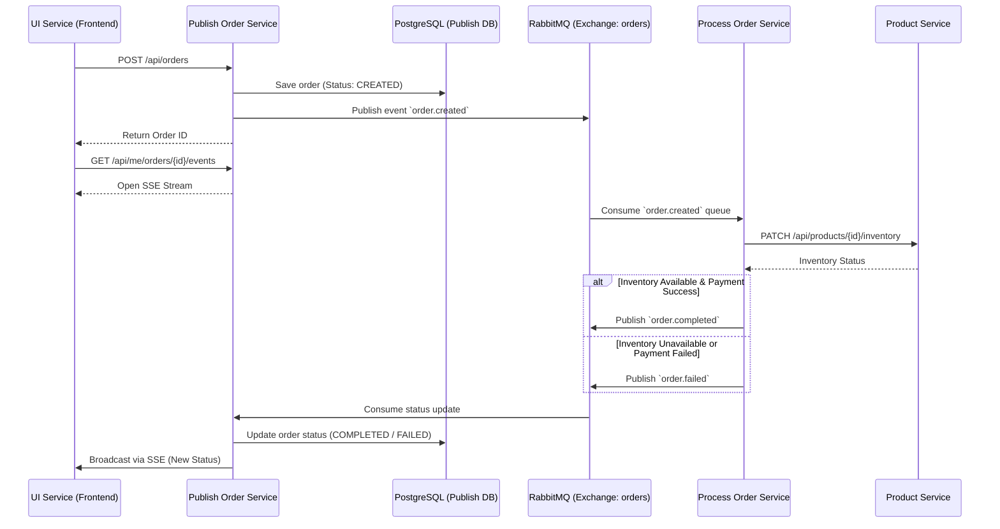

# Core Architecture & Event Flow

Velure relies on an event-driven Microservices architecture to handle its core business processes, particularly the order lifecycle. This approach ensures high availability, loose coupling, and scalability across the platform without relying on a single centralized database.

## Order Lifecycle Event Flow

The most critical flow in Velure is the order creation and processing pipeline. It utilizes HTTP for synchronous initial requests and Server-Sent Events (SSE), while relying on RabbitMQ for asynchronous processing between backend services.

Below is the sequence diagram illustrating the complete order lifecycle:

## Distributed State Management

In this architecture, Velure avoids a monolithic centralized database. Instead, state is managed across services using an event-driven approach.

The order transitions through the following states:
1. **CREATED**: The initial state when the `publish-order-service` receives the request and saves it to its local PostgreSQL database.
2. **PROCESSING**: The state when the `process-order-service` picks up the event from RabbitMQ and begins validating inventory via the `product-service` and handling simulated payment logic.
3. **COMPLETED / FAILED**: The terminal states. Once the `process-order-service` finishes its operations, it publishes a final event back to RabbitMQ. The `publish-order-service` consumes this, updates the local database, and pushes the final state to the frontend via SSE.

This decoupled design ensures that if the processing or product services are temporarily unavailable, orders are not lost—they remain safely queued in RabbitMQ until they can be processed.

## FAQ: Why RabbitMQ and not Amazon SQS?

A common question when seeing this architecture provisioned on AWS is: *"If the project uses Terraform and focuses on the cloud, why deploy a RabbitMQ broker (via Amazon MQ) instead of using a native serverless service like Amazon SQS?"*

The main answer is **learning objectives**.

As Velure is a project focused on solidifying DevSecOps and Cloud-Native Architecture knowledge, RabbitMQ presented a more challenging and enriching technical scope:

- **Complexity and Routing Patterns:** RabbitMQ uses a rich protocol (AMQP) and allows the implementation of complex patterns such as *Exchanges* (Topic, Direct, Fanout) and *Bindings*. SQS is primarily a simple queue (although it can be combined with SNS, managing topics and routing in RabbitMQ requires more detailed architectural configuration).
- **Infrastructure Management:** Provisioning and managing credentials, virtual hosts (vhosts), and RabbitMQ administration panels (including locally in Docker Compose) brought an extra level of operational complexity that 100% managed services like SQS completely abstract away.
- **Cloud-Agnostic Portability:** By writing the service layer in Go using generic AMQP, we kept the platform 100% cloud-agnostic. Velure can run on AWS, Google Cloud, or an on-premise cluster without vendor lock-in tied to the AWS SDK.

In a corporate scenario purely focused on costs and maintenance overhead on AWS, the SQS+SNS pair would be the pragmatic default choice. Here, RabbitMQ was deliberately chosen to exercise more advanced software engineering and DevOps topics.
