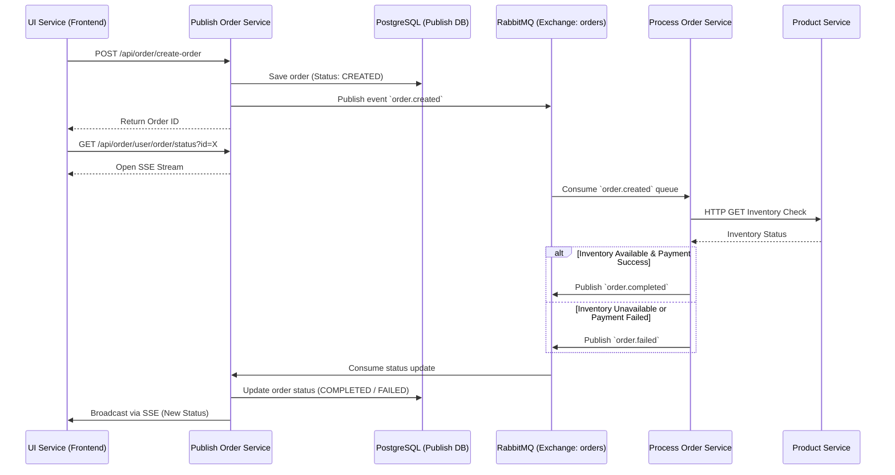

# Core Architecture & Event Flow

Velure relies on an event-driven microservices architecture to handle its core business processes, particularly the order lifecycle. This approach ensures high availability, loose coupling, and scalability across the platform without relying on a single centralized database.

## Order Lifecycle Event Flow

The most critical flow in Velure is the order creation and processing pipeline. It utilizes HTTP for synchronous initial requests and Server-Sent Events (SSE), while relying on RabbitMQ for asynchronous processing between backend services.

Below is the sequence diagram illustrating the complete order lifecycle:

## Distributed State Management

In this architecture, Velure avoids a monolithic centralized database. Instead, state is managed across services using an event-driven approach.

The order transitions through the following states:
1. **CREATED**: The initial state when the `publish-order-service` receives the request and saves it to its local PostgreSQL database.
2. **PROCESSING**: The state when the `process-order-service` picks up the event from RabbitMQ and begins validating inventory via the `product-service` and handling simulated payment logic.
3. **COMPLETED / FAILED**: The terminal states. Once the `process-order-service` finishes its operations, it publishes a final event back to RabbitMQ. The `publish-order-service` consumes this, updates the local database, and pushes the final state to the frontend via SSE.

This decoupled design ensures that if the processing or product services are temporarily unavailable, orders are not lost—they remain safely queued in RabbitMQ until they can be processed.
