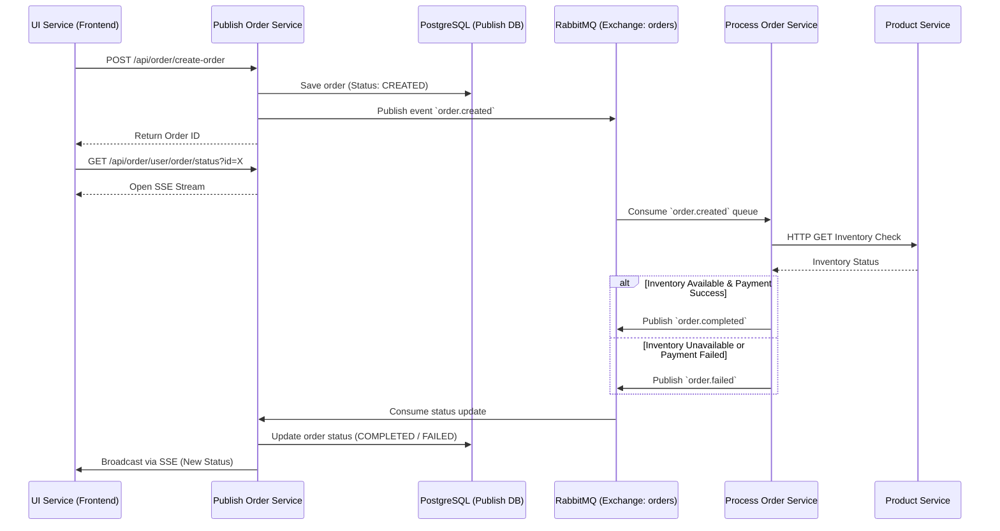
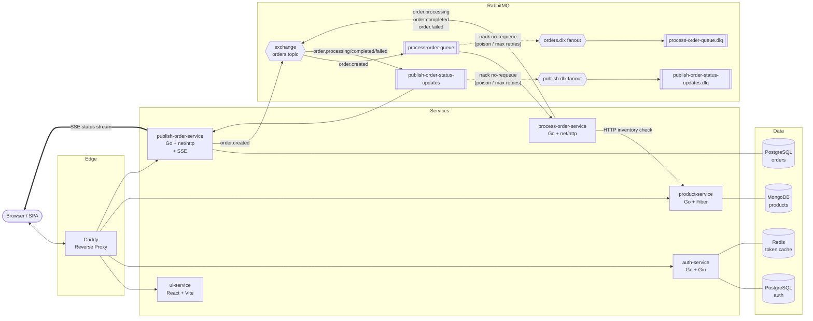

# Core Architecture & Event Flow

Velure relies on an event-driven microservices architecture to handle its core business processes, particularly the order lifecycle. This approach ensures high availability, loose coupling, and scalability across the platform without relying on a single centralized database.

## Order Lifecycle Event Flow

The most critical flow in Velure is the order creation and processing pipeline. It utilizes HTTP for synchronous initial requests and Server-Sent Events (SSE), while relying on RabbitMQ for asynchronous processing between backend services.

Below is the sequence diagram illustrating the complete order lifecycle:

## Distributed State Management

In this architecture, Velure avoids a monolithic centralized database. Instead, state is managed across services using an event-driven approach.

The order transitions through the following states:
1. **CREATED**: The initial state when the `publish-order-service` receives the request and saves it to its local PostgreSQL database.
2. **PROCESSING**: The state when the `process-order-service` picks up the event from RabbitMQ and begins validating inventory via the `product-service` and handling simulated payment logic.
3. **COMPLETED / FAILED**: The terminal states. Once the `process-order-service` finishes its operations, it publishes a final event back to RabbitMQ. The `publish-order-service` consumes this, updates the local database, and pushes the final state to the frontend via SSE.

This decoupled design ensures that if the processing or product services are temporarily unavailable, orders are not lost—they remain safely queued in RabbitMQ until they can be processed.

## High-Level Architecture

The diagram below shows the runtime topology: client traffic enters through Caddy, services own private data stores, RabbitMQ brokers async work, and every consumer queue is paired with a Dead Letter Queue (DLQ) so poison messages are quarantined instead of looping forever.

### Reading the diagram

- **Synchronous path:** Browser → Caddy → service. Caddy is the single ingress; never hit container ports directly.
- **Async path:** `publish-order-service` writes the `order.created` event to the `orders` topic exchange. `process-order-service` consumes it from `process-order-queue`, calls `product-service` for inventory, then republishes a status event. `publish-order-service` consumes that status from `publish-order-status-updates` and pushes it to the browser via SSE.
- **DLQ pattern:** Each consumer queue has `x-dead-letter-exchange` set. Permanent errors, parse failures and messages exceeding `maxRetries` are `Nack(false, false)` → routed to the per-stream DLX (`orders.dlx`, `publish.dlx`) → land in the matching DLQ for inspection/replay instead of looping back into the main queue.
- **State isolation:** Each service owns its own data store; cross-service queries happen over HTTP (`process → product`), never via shared schemas.
