# Arquitetura AWS - Velure Infrastructure

## 🏗️ Diagrama Mermaid

```mermaid
graph TB
    subgraph Internet["🌐 Internet"]
        Users[("👥 Users<br/>(HTTPS)")]
    end

    subgraph AWS["☁️ AWS Cloud - us-east-1"]
        subgraph VPC["🏢 VPC 10.0.0.0/16"]
            
            subgraph AZ1["📍 Availability Zone us-east-1a"]
                subgraph PublicSubnet["Public Subnet 10.0.1.0/24"]
                    IGW["🌐 Internet<br/>Gateway"]
                    NAT["🔀 NAT Gateway<br/>+ Elastic IP"]
                    ALB["⚖️ Application<br/>Load Balancer"]
                end
                
                subgraph PrivateSubnet1["Private Subnet 10.0.10.0/24"]
                    subgraph EKSNodes["🖥️ EKS Worker Nodes - 2x t3.small"]
                        Node1["Node 1<br/>20GB gp3"]
                        Node2["Node 2<br/>20GB gp3"]
                    end
                    
                    subgraph Pods1["☸️ Kubernetes Pods"]
                        AuthPod["🔐 auth-service"]
                        ProductPod["📦 product-service"]
                        PublishPod["📤 publish-order"]
                        ProcessPod["⚙️ process-order"]
                        UIPod["🎨 ui-service"]
                        RedisPod["💾 Redis<br/>1Gi PVC"]
                        RabbitPod["🐰 RabbitMQ<br/>2Gi PVC"]
                    end
                    
                    RDSAuth["🗄️ RDS PostgreSQL<br/>velure-auth<br/>db.t4g.micro<br/>20GB gp3"]
                end
            end
            
            subgraph AZ2["📍 Availability Zone us-east-1b"]
                subgraph PrivateSubnet2["Private Subnet 10.0.11.0/24"]
                    RDSOrders["🗄️ RDS PostgreSQL<br/>velure-orders<br/>db.t4g.micro<br/>20GB gp3<br/>shared"]
                end
            end
            
            subgraph SecurityGroups["🛡️ Security Groups"]
                SGEKS["EKS Nodes SG<br/>1025-65535←VPC<br/>443←Control Plane"]
                SGRDS["RDS SG<br/>5432←EKS only"]
                SGALB["ALB SG<br/>80,443←Internet"]
            end
        end
        
        subgraph EKSControl["☸️ EKS Control Plane - Managed"]
            K8sAPI["Kubernetes 1.28 API"]
            OIDC["🔐 OIDC Provider<br/>IRSA"]
            Addons["📦 EKS Addons:<br/>VPC CNI v1.15.1<br/>CoreDNS v1.10.1<br/>kube-proxy v1.28.2<br/>EBS CSI v1.25.0"]
        end
        
        subgraph IAM["🔑 IAM Roles & Policies"]
            ClusterRole["EKS Cluster Role"]
            NodeRole["EKS Node Role"]
            ALBRole["ALB Controller<br/>Role - IRSA"]
            EBSRole["EBS CSI Driver<br/>Role - IRSA"]
        end
        
        subgraph CloudWatch["📊 CloudWatch"]
            CWLogs["📝 Log Groups<br/>7 days retention:<br/>- EKS Control Plane<br/>- VPC Flow Logs<br/>- RDS Auth Logs<br/>- RDS Orders Logs"]
        end
    end
    
    subgraph External["🌍 External Services"]
        MongoDB["🍃 MongoDB Atlas<br/>existing"]
    end

    Users -->|HTTPS| ALB
    ALB -->|HTTP| AuthPod
    ALB -->|HTTP| ProductPod
    ALB -->|HTTP| PublishPod
    ALB -->|HTTP| UIPod
    
    IGW ---|Route| PublicSubnet
    NAT ---|Route| IGW
    PrivateSubnet1 ---|Route| NAT
    PrivateSubnet2 ---|Route| NAT
    
    AuthPod -.->|5432| RDSAuth
    PublishPod -.->|5432| RDSOrders
    ProcessPod -.->|5432| RDSOrders
    ProductPod -.->|27017| MongoDB
    
    AuthPod -.->|6379| RedisPod
    PublishPod -.->|5672| RabbitPod
    ProcessPod -.->|5672| RabbitPod
    
    K8sAPI ---|Manages| EKSNodes
    OIDC ---|Assumes| ALBRole
    OIDC ---|Assumes| EBSRole
    
    SGALB -.-|Protects| ALB
    SGEKS -.-|Protects| EKSNodes
    SGRDS -.-|Protects| RDSAuth
    SGRDS -.-|Protects| RDSOrders
    
    ClusterRole ---|Used by| K8sAPI
    NodeRole ---|Used by| EKSNodes
    
    EKSControl -.->|Logs| CWLogs
    VPC -.->|Flow Logs| CWLogs
    RDSAuth -.->|Logs| CWLogs
    RDSOrders -.->|Logs| CWLogs

    classDef awsService fill:#FF9900,stroke:#232F3E,stroke-width:2px,color:#fff
    classDef k8sService fill:#326CE5,stroke:#fff,stroke-width:2px,color:#fff
    classDef dbService fill:#527FFF,stroke:#fff,stroke-width:2px,color:#fff
    classDef secService fill:#DD344C,stroke:#fff,stroke-width:2px,color:#fff
    classDef external fill:#00A86B,stroke:#fff,stroke-width:2px,color:#fff
    
    class ALB,NAT,IGW,EKSControl,CloudWatch awsService
    class AuthPod,ProductPod,PublishPod,ProcessPod,UIPod,K8sAPI,Addons k8sService
    class RDSAuth,RDSOrders,RedisPod,RabbitPod,MongoDB dbService
    class SGEKS,SGRDS,SGALB,IAM,ClusterRole,NodeRole,ALBRole,EBSRole secService
    class External external
```



## 🏗️ Visão Geral ASCII

```
┌─────────────────────────────────────────────────────────────────────────────┐
│                              AWS Cloud (us-east-1)                           │
│                                                                              │
│  ┌────────────────────────────────────────────────────────────────────────┐ │
│  │                     VPC 10.0.0.0/16 (velure-prod-vpc)                  │ │
│      class External external
```

## 📊 Componentes Principais

### 1. Network Layer (VPC)

**VPC**: `10.0.0.0/16`
- **Public Subnet** (us-east-1a): `10.0.1.0/24`
  - NAT Gateway + Elastic IP
  - Application Load Balancer (criado pelo Ingress)
  - Internet Gateway attachment

- **Private Subnet 1** (us-east-1a): `10.0.10.0/24`
  - EKS Worker Nodes (2x t3.small)
  - RDS Auth Instance
  - Route to NAT Gateway

- **Private Subnet 2** (us-east-1b): `10.0.11.0/24`
  - RDS Orders Instance
  - Route to NAT Gateway (in us-east-1a)

**Observações**:
- Single NAT Gateway para economizar custos (~$32/mês vs ~$96/mês com 3)
- Segunda subnet apenas para RDS subnet group requirement
- Todos os recursos privados usam o mesmo NAT Gateway

### 2. Compute Layer (EKS)

**EKS Cluster**: `velure-prod`
- Kubernetes version: `1.28`
- API endpoint: Public + Private
- OIDC provider habilitado (IRSA)

**Node Group**: `velure-prod-node-group`
- Instance type: `t3.small` (2 vCPU, 2GB RAM)
- Min/Desired/Max: `1/2/2` nodes
- Capacity type: `ON_DEMAND` (pode usar SPOT para economizar 70%)
- Disk: `20GB gp3` cada
- Launch template: IMDSv2 enforced

**EKS Addons**:
- VPC CNI v1.15.1 (networking)
- CoreDNS v1.10.1 (DNS)
- kube-proxy v1.28.2 (networking)
- EBS CSI Driver v1.25.0 (persistent volumes)

### 3. Database Layer (RDS)

**Auth Database**: `velure-prod-auth`
- Engine: PostgreSQL 16.3
- Instance: `db.t4g.micro` (1 vCPU, 1GB RAM)
- Storage: `20GB gp3`
- Database: `velure_auth`
- Location: us-east-1a (private subnet 1)
- Free Tier eligible: Yes (750h/mês)

**Orders Database**: `velure-prod-orders`
- Engine: PostgreSQL 16.3
- Instance: `db.t4g.micro`
- Storage: `20GB gp3`
- Database: `velure_orders`
- Location: us-east-1b (private subnet 2)
- Shared by: publish-order + process-order services

**RDS Configuration**:
- Multi-AZ: Disabled (cost optimization)
- Backups: 7 days retention
- Enhanced Monitoring: Disabled
- Performance Insights: Disabled
- Encryption at rest: Enabled
- Publicly accessible: No

### 4. Security Layer

**Security Groups**:

1. **EKS Node SG**:
   - Inbound: 1025-65535 from VPC, 443 from Control Plane
   - Outbound: All traffic
   - Purpose: Proteger worker nodes

2. **RDS SG**:
   - Inbound: 5432 from EKS Node SG
   - Outbound: None
   - Purpose: Permitir apenas EKS acessar databases

3. **ALB SG**:
   - Inbound: 80, 443 from 0.0.0.0/0
   - Outbound: All traffic to EKS Node SG
   - Purpose: Load balancer público

**IAM Roles**:

1. **EKS Cluster Role**:
   - Managed policies: AmazonEKSClusterPolicy

2. **EKS Node Role**:
   - Managed policies:
     - AmazonEKSWorkerNodePolicy
     - AmazonEC2ContainerRegistryReadOnly
     - AmazonEKS_CNI_Policy

3. **ALB Controller Role** (IRSA):
   - Custom policy: 284 lines de permissions
   - Permite criar/gerenciar ALB, Target Groups, Listeners

4. **EBS CSI Driver Role** (IRSA):
   - Managed policy: AmazonEBSCSIDriverPolicy

### 5. Monitoring & Logging

**CloudWatch Log Groups**:
- `/aws/eks/velure-prod/cluster`: EKS control plane logs
- `/aws/vpc/velure-prod`: VPC Flow Logs
- `/aws/rds/instance/velure-prod-auth/postgresql`: Auth DB logs
- `/aws/rds/instance/velure-prod-orders/postgresql`: Orders DB logs

**Retention**: 7 days (cost optimization)

### 6. External Services (não gerenciados pelo Terraform)

**MongoDB Atlas**:
- Usado por: product-service
- Não criado no Terraform (já existe)

**Redis** (in-cluster via Helm):
- Namespace: default
- Architecture: standalone
- Storage: 1Gi PVC
- Resources: 256Mi RAM, 100m CPU

**RabbitMQ** (in-cluster via Helm):
- Namespace: default
- Authentication: admin user
- Storage: 2Gi PVC
- Resources: 256Mi RAM, 100m CPU

## 🔄 Fluxo de Tráfego

### Requisição Externa → Aplicação

```
1. User (HTTPS) → Internet
2. Internet → AWS Route53 (DNS)
3. Route53 → Application Load Balancer (Public Subnet)
4. ALB → Target Group → EKS Worker Nodes (Private Subnet)
5. Ingress Controller → Kubernetes Service → Pod
```

### Pod → RDS

```
1. Pod (Private Subnet us-east-1a)
2. → Security Group (permite 5432 de EKS nodes)
3. → RDS Instance (Private Subnet us-east-1a ou us-east-1b)
```

### Pod → Internet (npm install, git clone, etc)

```
1. Pod (Private Subnet)
2. → NAT Gateway (Public Subnet us-east-1a)
3. → Internet Gateway
4. → Internet
```

### Pod → MongoDB Atlas

```
1. Pod (Private Subnet)
2. → NAT Gateway (Public Subnet)
3. → Internet Gateway
4. → Internet
5. → MongoDB Atlas (cluster.mongodb.net)
```

## 💾 Persistent Storage

**EBS Volumes**:
- Worker Nodes: 2x 20GB gp3 (root volumes)
- Redis PVC: 1GB gp3 (via EBS CSI Driver)
- RabbitMQ PVC: 2GB gp3 (via EBS CSI Driver)

**RDS Storage**:
- Auth DB: 20GB gp3 (auto-scaling até 30GB)
- Orders DB: 20GB gp3 (auto-scaling até 30GB)

## 🔐 Secrets Management

**Sensitive Data**:
- RDS passwords: Terraform variables (sensitive)
- Redis password: Kubernetes Secret
- RabbitMQ password: Kubernetes Secret
- JWT secrets: Kubernetes Secret

**Recomendação**: Usar AWS Secrets Manager + External Secrets Operator para produção

## 📈 Escalabilidade

**Horizontal Scaling**:
- Worker Nodes: Configurado para 1-2 nodes (pode aumentar max_size)
- Pods: Configurar HPA (Horizontal Pod Autoscaler) baseado em CPU/memória
- RDS: Não escala horizontalmente (limitação Free Tier)

**Vertical Scaling**:
- Worker Nodes: Trocar instance type (ex: t3.small → t3.medium)
- RDS: Trocar instance class (ex: db.t4g.micro → db.t4g.small)

**Limitações Atuais**:
- Single NAT Gateway = single point of failure
- Single AZ para nodes = sem HA cross-AZ
- RDS sem Multi-AZ = sem failover automático

## 🛡️ Disaster Recovery

**Backups**:
- RDS: Automated backups (7 days retention)
- EBS: Manual snapshots recomendado
- Application state: Redis/RabbitMQ = não persistente

**RTO/RPO**:
- RDS Recovery Time: ~10-15 minutos
- EKS Recreation: ~15-20 minutos
- RPO: 7 dias (retention period)

**Recomendações**:
- Habilitar Multi-AZ para RDS (produção)
- Implementar Velero para backups de Kubernetes
- Usar S3 para backups críticos

## 📊 Cost Optimization

**Implementado**:
- ✅ Single AZ deployment
- ✅ Single NAT Gateway
- ✅ t3.small nodes (mínimo para EKS)
- ✅ db.t4g.micro RDS (Free Tier)
- ✅ CloudWatch logs 7 days retention
- ✅ Enhanced Monitoring desabilitado
- ✅ Performance Insights desabilitado

**Potencial**:
- 🔄 Usar Spot Instances (70% economia)
- 🔄 Reserved Instances (30-40% economia)
- 🔄 Desligar infra fora do horário comercial
- 🔄 Compartilhar RDS entre todos os services

---

**Última atualização**: Dezembro 2024
