# Diagrama de Arquitetura AWS - Velure

## Visão Geral da Infraestrutura

```mermaid
graph TB
    subgraph Internet["🌐 Internet"]
        Users[("👥 Users<br/>(HTTPS)")]
    end

    subgraph AWS["☁️ AWS Cloud - us-east-1"]
        subgraph VPC["🏢 VPC 10.0.0.0/16"]
            
            subgraph AZ1["📍 Availability Zone us-east-1a"]
                subgraph PublicSubnet["Public Subnet 10.0.1.0/24"]
                    IGW["🌐 Internet<br/>Gateway"]
                    NAT["🔀 NAT Gateway<br/>+ Elastic IP"]
                    ALB["⚖️ Application<br/>Load Balancer"]
                end
                
                subgraph PrivateSubnet1["Private Subnet 10.0.10.0/24"]
                    subgraph EKSNodes["🖥️ EKS Worker Nodes (2x t3.small)"]
                        Node1["Node 1<br/>20GB gp3"]
                        Node2["Node 2<br/>20GB gp3"]
                    end
                    
                    subgraph Pods1["☸️ Kubernetes Pods"]
                        AuthPod["🔐 auth-service"]
                        ProductPod["📦 product-service"]
                        PublishPod["📤 publish-order"]
                        ProcessPod["⚙️ process-order"]
                        UIPod["🎨 ui-service"]
                        RedisPod["💾 Redis<br/>(1Gi PVC)"]
                        RabbitPod["🐰 RabbitMQ<br/>(2Gi PVC)"]
                    end
                    
                    RDSAuth["🗄️ RDS PostgreSQL<br/>velure-auth<br/>db.t4g.micro<br/>20GB gp3"]
                end
            end
            
            subgraph AZ2["📍 Availability Zone us-east-1b"]
                subgraph PrivateSubnet2["Private Subnet 10.0.11.0/24"]
                    RDSOrders["🗄️ RDS PostgreSQL<br/>velure-orders<br/>db.t4g.micro<br/>20GB gp3<br/>(shared)"]
                end
            end
            
            subgraph SecurityGroups["🛡️ Security Groups"]
                SGEKS["EKS Nodes SG<br/>1025-65535←VPC<br/>443←Control Plane"]
                SGRDS["RDS SG<br/>5432←EKS only"]
                SGALB["ALB SG<br/>80,443←0.0.0.0/0"]
            end
        end
        
        subgraph EKSControl["☸️ EKS Control Plane (Managed)"]
            K8sAPI["Kubernetes 1.28 API"]
            OIDC["🔐 OIDC Provider<br/>(IRSA)"]
            Addons["📦 EKS Addons:<br/>VPC CNI v1.15.1<br/>CoreDNS v1.10.1<br/>kube-proxy v1.28.2<br/>EBS CSI v1.25.0"]
        end
        
        subgraph IAM["🔑 IAM Roles & Policies"]
            ClusterRole["EKS Cluster Role"]
            NodeRole["EKS Node Role"]
            ALBRole["ALB Controller<br/>Role (IRSA)"]
            EBSRole["EBS CSI Driver<br/>Role (IRSA)"]
        end
        
        subgraph CloudWatch["📊 CloudWatch"]
            CWLogs["📝 Log Groups<br/>(7 days retention):<br/>- EKS Control Plane<br/>- VPC Flow Logs<br/>- RDS Auth Logs<br/>- RDS Orders Logs"]
        end
    end
    
    subgraph External["🌍 External Services"]
        MongoDB["🍃 MongoDB Atlas<br/>(existing)"]
    end

    %% Traffic Flow
    Users -->|HTTPS| ALB
    ALB -->|HTTP| AuthPod
    ALB -->|HTTP| ProductPod
    ALB -->|HTTP| PublishPod
    ALB -->|HTTP| UIPod
    
    %% Internet Access
    IGW ---|Route| PublicSubnet
    NAT ---|Route| IGW
    PrivateSubnet1 ---|Route| NAT
    PrivateSubnet2 ---|Route| NAT
    
    %% Database Connections
    AuthPod -.->|5432| RDSAuth
    PublishPod -.->|5432| RDSOrders
    ProcessPod -.->|5432| RDSOrders
    ProductPod -.->|27017| MongoDB
    
    %% In-Cluster Services
    AuthPod -.->|6379| RedisPod
    PublishPod -.->|5672| RabbitPod
    ProcessPod -.->|5672| RabbitPod
    
    %% EKS Control Plane
    K8sAPI ---|Manages| EKSNodes
    OIDC ---|Assumes| ALBRole
    OIDC ---|Assumes| EBSRole
    
    %% Security Groups
    SGALB -.-|Protects| ALB
    SGEKS -.-|Protects| EKSNodes
    SGRDS -.-|Protects| RDSAuth
    SGRDS -.-|Protects| RDSOrders
    
    %% IAM
    ClusterRole ---|Used by| K8sAPI
    NodeRole ---|Used by| EKSNodes
    
    %% Monitoring
    EKSControl -.->|Logs| CWLogs
    VPC -.->|Flow Logs| CWLogs
    RDSAuth -.->|Logs| CWLogs
    RDSOrders -.->|Logs| CWLogs

    classDef awsService fill:#FF9900,stroke:#232F3E,stroke-width:2px,color:#fff
    classDef k8sService fill:#326CE5,stroke:#fff,stroke-width:2px,color:#fff
    classDef dbService fill:#527FFF,stroke:#fff,stroke-width:2px,color:#fff
    classDef secService fill:#DD344C,stroke:#fff,stroke-width:2px,color:#fff
    classDef external fill:#00A86B,stroke:#fff,stroke-width:2px,color:#fff
    
    class ALB,NAT,IGW,EKSControl,CloudWatch awsService
    class AuthPod,ProductPod,PublishPod,ProcessPod,UIPod,K8sAPI,Addons k8sService
    class RDSAuth,RDSOrders,RedisPod,RabbitPod,MongoDB dbService
    class SGEKS,SGRDS,SGALB,IAM,ClusterRole,NodeRole,ALBRole,EBSRole secService
    class External external
```

## Fluxo de Requisições

```mermaid
sequenceDiagram
    participant User as 👥 User
    participant DNS as 🌐 Route53
    participant ALB as ⚖️ ALB
    participant Ingress as 📥 Ingress Controller
    participant Service as ☸️ K8s Service
    participant Pod as 🔐 Auth Pod
    participant Redis as 💾 Redis
    participant RDS as 🗄️ RDS Auth

    User->>DNS: velure.com
    DNS->>User: ALB IP Address
    User->>ALB: HTTPS Request
    ALB->>Ingress: HTTP Request
    Ingress->>Service: Forward to Service
    Service->>Pod: Route to Pod
    
    Pod->>Redis: Check Session Cache
    alt Cache Hit
        Redis-->>Pod: Return Cached Data
    else Cache Miss
        Pod->>RDS: Query Database
        RDS-->>Pod: Return Data
        Pod->>Redis: Update Cache
    end
    
    Pod-->>Service: Response
    Service-->>Ingress: Response
    Ingress-->>ALB: Response
    ALB-->>User: HTTPS Response
```

## Arquitetura de Pods e Services

```mermaid
graph LR
    subgraph Ingress["🔀 Ingress (ALB)"]
        IngressRules["Rules:<br/>/api/auth → auth<br/>/api/products → product<br/>/api/orders → publish<br/>/ → ui"]
    end
    
    subgraph Services["☸️ Kubernetes Services"]
        AuthSvc["auth-service<br/>ClusterIP"]
        ProductSvc["product-service<br/>ClusterIP"]
        PublishSvc["publish-order-service<br/>ClusterIP"]
        ProcessSvc["process-order-service<br/>ClusterIP"]
        UISvc["ui-service<br/>ClusterIP"]
        RedisSvc["redis<br/>ClusterIP"]
        RabbitSvc["rabbitmq<br/>ClusterIP"]
    end
    
    subgraph Deployments["📦 Deployments"]
        AuthDeploy["auth-service<br/>replicas: 2<br/>resources:<br/>256Mi/100m"]
        ProductDeploy["product-service<br/>replicas: 2<br/>resources:<br/>256Mi/100m"]
        PublishDeploy["publish-order-service<br/>replicas: 2<br/>resources:<br/>256Mi/100m"]
        ProcessDeploy["process-order-service<br/>replicas: 2<br/>resources:<br/>256Mi/100m"]
        UIDeploy["ui-service<br/>replicas: 2<br/>resources:<br/>128Mi/50m"]
        RedisStateful["redis<br/>StatefulSet<br/>replicas: 1"]
        RabbitStateful["rabbitmq<br/>StatefulSet<br/>replicas: 1"]
    end
    
    subgraph Storage["💾 Persistent Storage"]
        RedisPVC["Redis PVC<br/>1Gi gp3"]
        RabbitPVC["RabbitMQ PVC<br/>2Gi gp3"]
    end
    
    subgraph External["🗄️ External Databases"]
        RDSAuth["RDS Auth<br/>PostgreSQL"]
        RDSOrders["RDS Orders<br/>PostgreSQL"]
        MongoDB["MongoDB Atlas"]
    end
    
    IngressRules --> AuthSvc
    IngressRules --> ProductSvc
    IngressRules --> PublishSvc
    IngressRules --> UISvc
    
    AuthSvc --> AuthDeploy
    ProductSvc --> ProductDeploy
    PublishSvc --> PublishDeploy
    ProcessSvc --> ProcessDeploy
    UISvc --> UIDeploy
    RedisSvc --> RedisStateful
    RabbitSvc --> RabbitStateful
    
    RedisStateful --> RedisPVC
    RabbitStateful --> RabbitPVC
    
    AuthDeploy -.->|5432| RDSAuth
    PublishDeploy -.->|5432| RDSOrders
    ProcessDeploy -.->|5432| RDSOrders
    ProductDeploy -.->|27017| MongoDB
    
    AuthDeploy -.->|6379| RedisSvc
    PublishDeploy -.->|5672| RabbitSvc
    ProcessDeploy -.->|5672| RabbitSvc

    classDef ingressClass fill:#FF6B6B,stroke:#C92A2A,stroke-width:2px,color:#fff
    classDef serviceClass fill:#4ECDC4,stroke:#0D7377,stroke-width:2px,color:#fff
    classDef deployClass fill:#95E1D3,stroke:#38A169,stroke-width:2px,color:#000
    classDef storageClass fill:#FEC260,stroke:#F77F00,stroke-width:2px,color:#000
    classDef dbClass fill:#1A535C,stroke:#4ECDC4,stroke-width:2px,color:#fff
    
    class IngressRules ingressClass
    class AuthSvc,ProductSvc,PublishSvc,ProcessSvc,UISvc,RedisSvc,RabbitSvc serviceClass
    class AuthDeploy,ProductDeploy,PublishDeploy,ProcessDeploy,UIDeploy,RedisStateful,RabbitStateful deployClass
    class RedisPVC,RabbitPVC storageClass
    class RDSAuth,RDSOrders,MongoDB dbClass
```

## Comunicação entre Microserviços

## Network Security

```mermaid
graph TB
    subgraph Internet["🌐 Internet"]
        Attacker["⚠️ Any IP"]
        User["✅ User"]
    end
    
    subgraph PublicSubnet["Public Subnet"]
        ALB["⚖️ ALB<br/>SG: alb-sg"]
    end
    
    subgraph PrivateSubnet["Private Subnet"]
        EKS["☸️ EKS Nodes<br/>SG: eks-node-sg"]
        RDS["🗄️ RDS<br/>SG: rds-sg"]
    end
    
    User -->|"✅ 80/443<br/>Allowed"| ALB
    Attacker -->|"❌ Other ports<br/>Blocked"| ALB
    
    ALB -->|"✅ Any port<br/>Allowed"| EKS
    
    EKS -->|"✅ 5432<br/>Allowed"| RDS
    ALB -->|"❌ 5432<br/>Blocked"| RDS
    Internet -->|"❌ Any<br/>Blocked"| RDS
    
    EKS -.->|"✅ HTTPS<br/>via NAT"| Internet
    RDS -.->|"❌ No outbound"| Internet

    classDef allowedClass fill:#48BB78,stroke:#38A169,stroke-width:2px,color:#fff
    classDef blockedClass fill:#F56565,stroke:#E53E3E,stroke-width:2px,color:#fff
    classDef resourceClass fill:#4299E1,stroke:#3182CE,stroke-width:2px,color:#fff
    
    class User,ALB,EKS allowedClass
    class Attacker,RDS blockedClass
```

## IRSA (IAM Roles for Service Accounts)

## Terraform Modules

## Cost Breakdown

```mermaid
pie title Custos Mensais (~$143/mês com Spot)
    "EKS Control Plane" : 73.00
    "NAT Gateway" : 37.35
    "RDS (Free Tier)" : 17.73
    "EC2 Spot Instances" : 9.05
    "EBS Volumes" : 3.20
    "CloudWatch Logs" : 2.65
```

