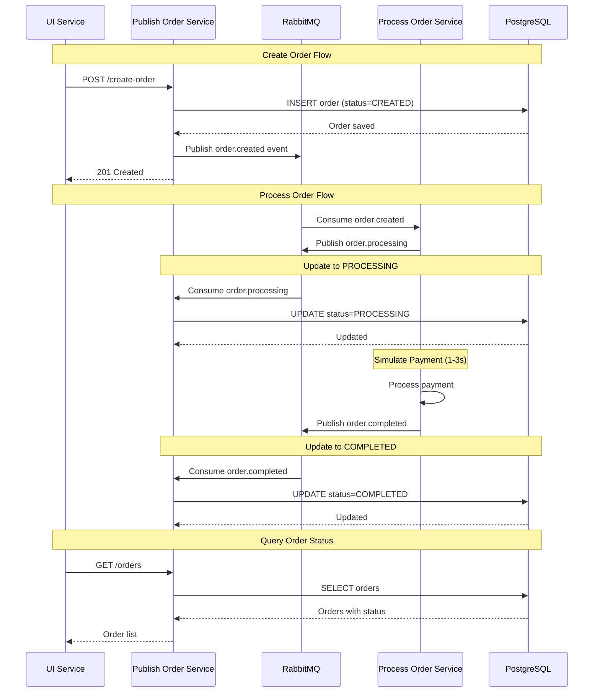

# Order Status Update Flow



## Components

### Publish Order Service
- **Publisher**: Publica `order.created` events
- **Consumer**: Consome `order.processing` e `order.completed` events
- **Repository**: Persiste pedidos no PostgreSQL

### Process Order Service
- **Consumer**: Consome `order.created` events
- **Publisher**: Publica `order.processing` e `order.completed` events
- **Service**: Simula processamento de pagamento

### RabbitMQ
- **Exchange**: `order_events` (topic)
- **Queues**:
  - `order_created_queue`: Para process-order-service
  - `publish-order-status-updates`: Para publish-order-service

## Event Flow

```
order.created
  ↓
[Process Order Service]
  ↓
order.processing → [Publish Order Service] → UPDATE status=PROCESSING
  ↓
[Payment Processing]
  ↓
order.completed → [Publish Order Service] → UPDATE status=COMPLETED
```

## Status Transitions

```
CREATED → PROCESSING → COMPLETED
  ↑           ↑            ↑
  |           |            |
  |           |            └─ order.completed event
  |           └─────────────── order.processing event
  └──────────────────────────── Initial creation
```
