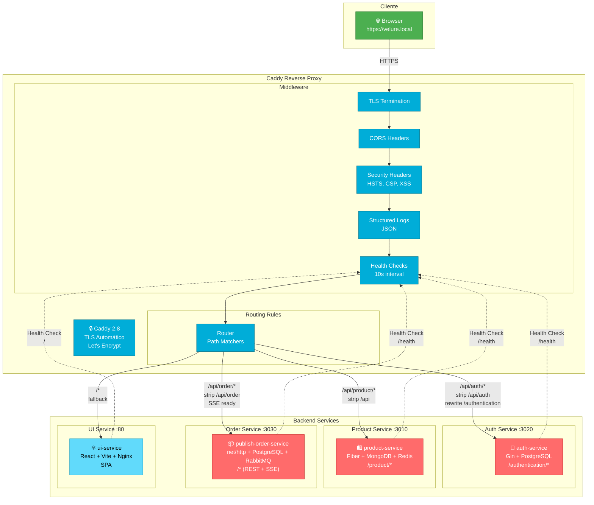
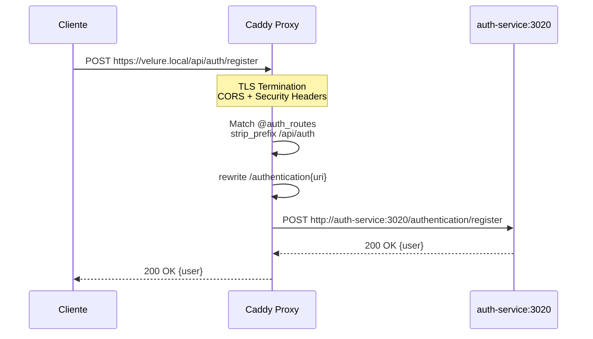
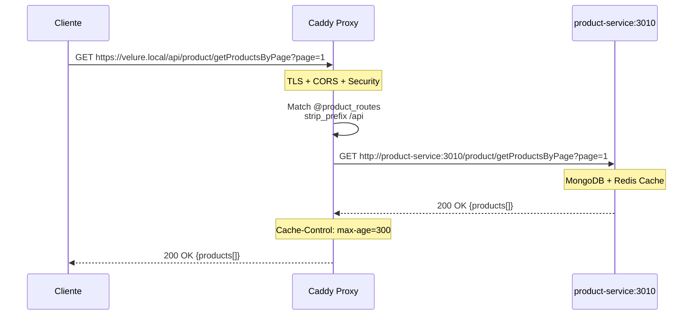
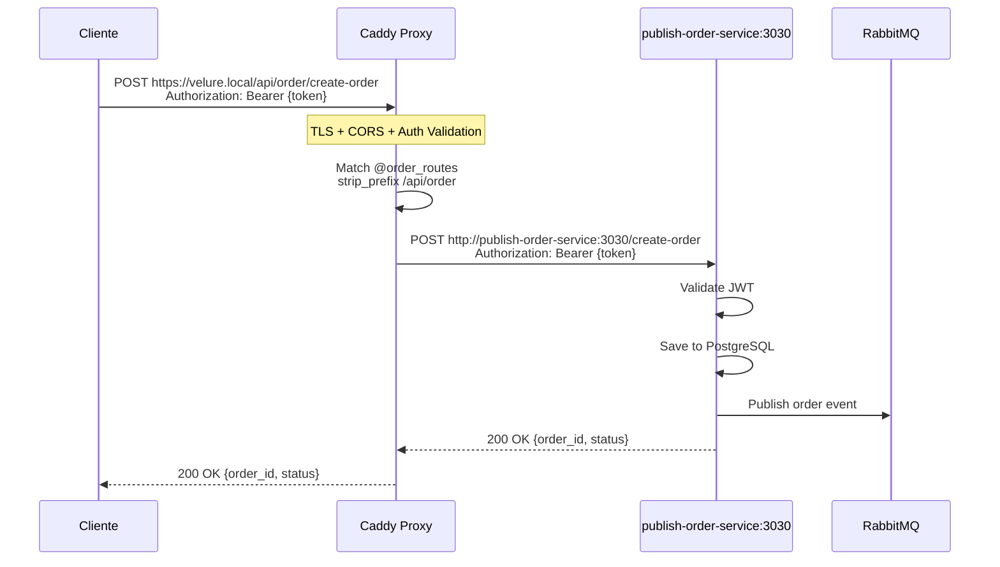
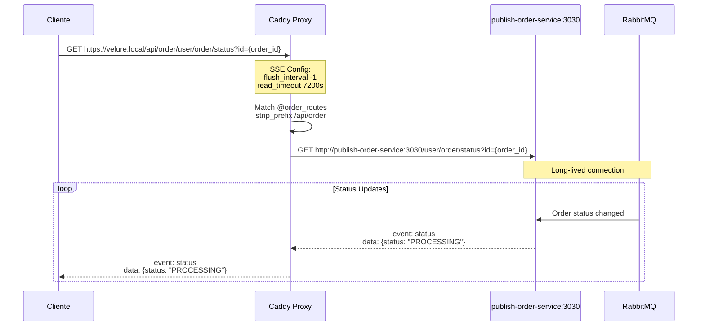

# Caddy Reverse Proxy - Arquitetura

## Visão Geral

Este documento descreve a arquitetura do proxy reverso Caddy implementado no projeto Velure, centralizando o acesso a todos os microserviços através de um único ponto de entrada com TLS automático.

## Diagrama de Arquitetura



## Fluxo de Requisições

### 1. Autenticação (POST /api/auth/register)



### 2. Listagem de Produtos (GET /api/product/getProductsByPage)



### 3. Criação de Pedido (POST /api/order/create-order)



### 4. Server-Sent Events (GET /api/order/user/order/status)



## Configuração de Rotas

| Path Frontend | Caddy Matcher | Strip Prefix | Upstream Service | Endpoint Final |
|--------------|---------------|--------------|------------------|----------------|
| `/api/auth/register` | `@auth_routes path /api/auth/*` | `/api/auth` + rewrite `/authentication` | `auth-service:3020` | `/authentication/register` |
| `/api/auth/login` | `@auth_routes path /api/auth/*` | `/api/auth` + rewrite `/authentication` | `auth-service:3020` | `/authentication/login` |
| `/api/product/getProductsByPage` | `@product_routes path /api/product/*` | `/api` | `product-service:3010` | `/product/getProductsByPage` |
| `/api/order/create-order` | `@order_routes path /api/order/*` | `/api/order` | `publish-order-service:3030` | `/create-order` |
| `/api/order/user/orders` | `@order_routes path /api/order/*` | `/api/order` | `publish-order-service:3030` | `/user/orders` |
| `/api/order/user/order/status` | `@order_routes path /api/order/*` | `/api/order` | `publish-order-service:3030` | `/user/order/status` (SSE) |
| `/` | Fallback | - | `ui-service:80` | `/` (SPA) |

## Funcionalidades Implementadas

### 🔒 Segurança

- **TLS Automático**: Let's Encrypt para produção, certificados locais para desenvolvimento
- **Security Headers**:
  - `Strict-Transport-Security`: HSTS com 1 ano
  - `X-Content-Type-Options`: nosniff
  - `X-Frame-Options`: SAMEORIGIN
  - `X-XSS-Protection`: 1; mode=block
  - `Content-Security-Policy`: CSP configurado
  - `Referrer-Policy`: strict-origin-when-cross-origin
- **CORS**: Headers configurados para permitir cross-origin de forma controlada
- **JWT Validation**: Middleware de autenticação nos serviços

### 📊 Observabilidade

- **Structured Logging**: Logs em JSON com campos estruturados
- **Log Rotation**: 
  - Global: 100MB por arquivo, mantém 5 arquivos
  - Por domínio: 50MB por arquivo, mantém 3 arquivos
- **Health Checks**: 
  - Intervalo: 10 segundos
  - Timeout: 5 segundos
  - Status esperado: 2xx

### ⚡ Performance

- **Compression**: gzip, zstd, brotli automático
- **Cache Headers**: Cache de 5 minutos para produtos
- **Connection Pooling**: Mantém conexões com upstreams
- **SSE Optimization**: 
  - `flush_interval -1`: Flush imediato
  - Long timeouts: 2 horas para conexões SSE
  - `X-Accel-Buffering: no`: Desabilita buffering

### 🎯 Resiliência

- **Health Checks Ativos**: Monitora saúde dos upstreams
- **Graceful Degradation**: Remove upstreams não saudáveis do pool
- **Timeouts Configurados**: 
  - Dial: 10s
  - Response: 30s (auth), 7200s (SSE)
- **Error Pages**: Páginas de erro customizadas em JSON

## Variáveis de Ambiente (Frontend)

```bash
# docker-compose.yaml
VITE_PRODUCT_SERVICE_URL=/api/product
VITE_AUTHENTICATION_SERVICE_URL=/api/auth
VITE_ORDER_SERVICE_URL=/api/order
```

Todas as URLs são relativas, permitindo que o frontend use automaticamente o mesmo domínio (velure.local) para chamadas de API.

## Portas

| Serviço | Porta Interna | Porta Externa | Exposta? |
|---------|---------------|---------------|----------|
| Caddy | 80, 443 | 80, 443 | ✅ Sim |
| auth-service | 3020 | - | ❌ Não |
| product-service | 3010 | - | ❌ Não |
| publish-order-service | 3030 | - | ❌ Não |
| ui-service | 80 | - | ❌ Não |

**Benefício**: Apenas Caddy expõe portas, todos os outros serviços são acessíveis apenas via proxy reverso, aumentando a segurança.

## Deployment

### Desenvolvimento

```bash
# Inicia todos os serviços incluindo Caddy
docker compose up -d

# Acessa via HTTPS (certificados auto-assinados)
https://velure.local
```

### Produção (EKS)

1. **Domínio Real**: Configurar DNS apontando para Load Balancer
2. **Let's Encrypt**: Remover `local_certs` do Caddyfile
3. **Ingress Controller**: Caddy como Ingress ou usar AWS ALB
4. **Secrets**: Externalizar via External Secrets Operator
5. **Observability**: Integrar com Prometheus/Grafana/Loki

## Próximos Passos

- [ ] Rate limiting por IP/endpoint
- [ ] WAF (Web Application Firewall)
- [ ] Prometheus metrics via `/metrics`
- [ ] Distributed tracing (OpenTelemetry)
- [ ] A/B testing via path rewrite
- [ ] Canary deployments
- [ ] Blue/Green deployments via weighted load balancing
